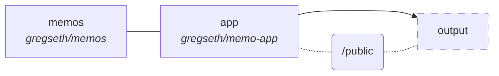

A Sinatra app for memos display
===============================


## Structure 





## Usage

### Editing a memo

Clone the « memos » repository, edit and push. A GitHub webhook is triggered, which will automatically update the repository on the server, making the edits available to the public.

### Adding new file to the ToC

First follow the same steps than for editing a memo. Then clone this repository and edit the `public/toc.json` file, providing:

-   the category name;
-   the file name (without the extension);
-   the title of the link displayed on the table of contents;
-   the class of the ling, can be `markdown` for a Markdown file or an empty string for a text file.

Example:

```json
[ {
    "name":   "Category",
    "values": [ {
        "link":   "subdir/markdown_file",
        "lbl":    "Title 1",
        "cls":    "markdown"
    }, {
        "link":   "text_file",
        "lbl":    "Title 2",
        "cls":    ""
    } ]
} ]
```

Finally commit and push the changes, and let the GitHub webhook handle the update.
